<!-- Banner -->

  

---

## 👨‍💻 About Me

- 🧠 Backend Software Engineer with strong focus on **Java**, **Kotlin**, and **Spring Boot**
- 💡 Passionate about **microservices**, **system design**, and **data engineering**
- 🔭 Currently exploring: **AWS, Spark, and high-scale architectures**
- 🛠️ Love clean architecture, modular design, and automation
- 🎯 Always up for LeetCode & real-world backend challenges
- 📍 Based in 🇲🇽 Mexico

```mermaid
mindmap
  root((Alejandro López 🧠))
    Backend Engineer 💻
      Java ☕
      Kotlin 🟣
      Spring Boot 🌱
      Micronaut 🚀
    Cloud ☁️
      AWS Lambda
      AWS S3
      SNS / SQS
    Data Engineering 🔥
      Apache Spark
      SQL (PostgreSQL, MySQL)
    System Design 🏗️
      Scalability
      Microservices
      Event-Driven Architecture
    Tools & DevOps 🛠️
      Docker 🐳
      GitHub 🐙
      CI/CD ⚙️
    Loves ❤️
      Coffee ☕
      Debugging 🔍
      Coding Challenges 💡
```

---

## 📌 Pinned Projects

  
  

---

## 📊 GitHub Stats & Visuals

  
  

  

  

## 🔧  Software Engineer Priorities 

```mermaid
flowchart LR
    A{Work or Sleep?} -->|Work| B[Write Code 💻]
    A -->|Sleep| C[Dream of Code 🤖]
    B --> D{Bug Found?}
    D -->|Yes| E[Debug until 3AM 🕒]
    D -->|No| F[Push to GitHub ✅]
    E --> B
```

